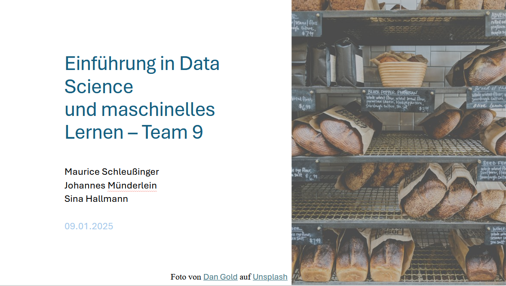

# Sales Forecasting for a Bakery Branch

## Repository Link

https://github.com/AI-sInA/Data-Science-und-ML-Team-9

## Description

This project focuses on sales forecasting for a bakery branch, utilizing historical sales data spanning from July 1, 2013, to July 30, 2018, to inform inventory and staffing decisions. We aim to predict future sales for six specific product categories: Bread, Rolls, Croissants, Confectionery and Cakes. Our methodology integrates statistical and machine learning techniques, beginning with a baseline linear regression model to identify fundamental trends, and progressing to a sophisticated neural network designed to discern more nuanced patterns and enhance forecast precision. The initiative encompasses data preparation, crafting bar charts with confidence intervals for visualization, and fine-tuning models to assess their performance on test data from August 1, 2018, to July 30, 2019, using the Mean Absolute Percentage Error (MAPE) metric for each product category.


## Technical Requirements

- Python 3.11 or similar

The following Python libraries, e.g. installed with pip.

````
numpy==1.26.4
pandas==2.2.3
optuna==4.1.0
tensorflow==2.18.0
keras==3.7.0
sklearn==1.6.0
matplotlib==3.9.3
````
### Task Type

Regression

### Results Summary

MAPE results by Category were much worse than expected. Especially compared to how the model performed in the Kaggle competition.
-   **Best Model:** Sequential model with 3 optimised layers (ReLU, Tanh, ReLU)
-   **Evaluation Metric:** MAPE
-   **Result by Category** (Identifier):
    -   **Bread** (1): 56.38%
    -   **Rolls** (2): 22.52%
    -   **Croissant** (3): 28.74%
    -   **Confectionery** (4): 76.61%
    -   **Cake** (5): 30.36%

## Documentation

Each project milestone has a seperate Jupyther Notebook where all cells can be run top to bottom to produce the desired results for the milestone. More details are provided in the seperate README files for each milestone (in German language): 

1.  [**Data Import and Preparation**](0_DataPreparation/)
3.  [**Dataset Characteristics (Barcharts)**](1_DatasetCharacteristics/)
4.  [**Baseline Model**](2_BaselineModel/)
5.  [**Model Definition and Evaluation**](3_Model/)
6.  [**Presentation**](4_Presentation/README.md)

## Cover Image


